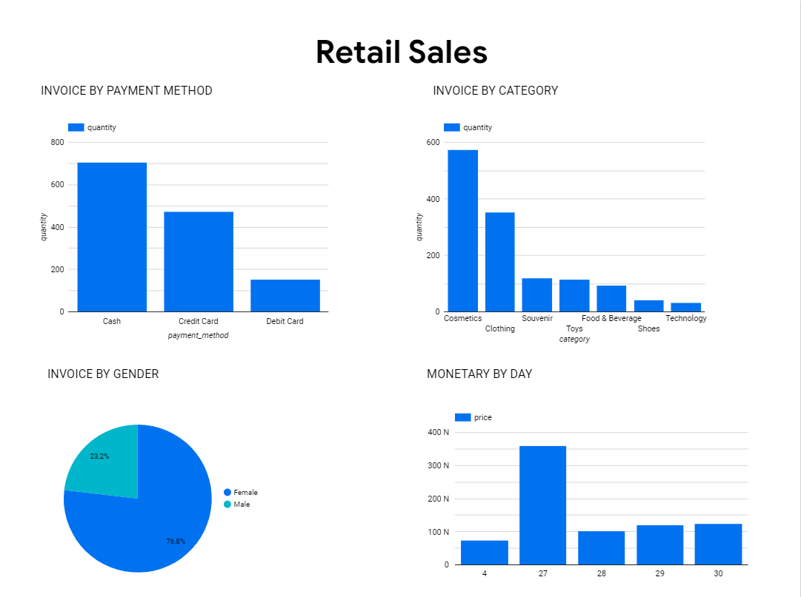

# Project: Retail Sales Data Pipeline

## Description
This project is a part of Data Engineering Zoomcamp

## About Dataset
### Context
Many thanks for Kaggle of providing Dataset. [Customer Shopping Dataset - Retail Sales Data](https://www.kaggle.com/datasets/mehmettahiraslan/customer-shopping-dataset) for your interest.

''Our dataset contains shopping information from 10 different shopping malls between 2021 and 2023. We have gathered data from various age groups and genders to provide a comprehensive view of shopping habits in Istanbul. The dataset includes essential information such as invoice numbers, customer IDs, age, gender, payment methods, product categories, quantity, price, order dates, and shopping mall locations. We hope that this dataset will serve as a valuable resource for researchers, data analysts, and machine learning enthusiasts who want to gain insights into shopping trends and patterns in Istanbul. Explore the dataset and discover the fascinating world of Istanbul shopping!''

### Attribute Information:
- invoice_no: Invoice number. Nominal. A combination of the letter 'I' and a 6-digit integer uniquely assigned to each operation.
- customer_id: Customer number. Nominal. A combination of the letter 'C' and a 6-digit integer uniquely assigned to each operation.
- gender: String variable of the customer's gender.
- age: Positive Integer variable of the customers age.
- category: String variable of the category of the purchased product.
- quantity: The quantities of each product (item) per transaction. Numeric.
- price: Unit price. Numeric. Product price per unit in Turkish Liras (TL).
- payment_method: String variable of the payment method (cash, credit card or debit card) used for the transaction.
- invoice_date: Invoice date. The day when a transaction was generated.
- shopping_mall: String variable of the name of the shopping mall where the transaction was made.
## Tools

## Setup Pipeline
### Step 1:
This course is mainly built on the background of GCP. Follow the [course's GCP guideline](https://github.com/ankurchavda/streamify/blob/main/setup/gcp.md) to create account, download gcloud SDK (it's a need when you want to connect to your Virtual Machine instances from local machine)

### Step 2: Setup infrastructure - terraform
Check out course's terraform guideline for more information.
Check out [2_terraform-README.md](https://github.com/dannhh/retail-sales/blob/main/2_terraform_gcp/README.md) for the setting of this project. 

### Step 3: Start Kafka
Check out [3_kafka-README.md](https://github.com/dannhh/retail-sales/blob/main/3_kafka/README.md)

### Step 4: Spark streaming
Check out [4_spark_streaming-README.md](https://github.com/dannhh/retail-sales/blob/main/4_spark_streaming/README.md)

### Step 5: Airflow and DBT
Check out [6_airflow_streaming-README.md](https://github.com/dannhh/retail-sales/blob/main/6_airflow/README.md)

CONTINUE UPDATING !!!

### Dashboard

Link dashboard: [Retail Sale Dashboard](https://lookerstudio.google.com/reporting/8cb34a16-854d-43d6-a1f6-d402c1499230)

## References
- https://github.com/sadiayousafzai036/FinalProject
- https://github.com/ankurchavda/streamify
